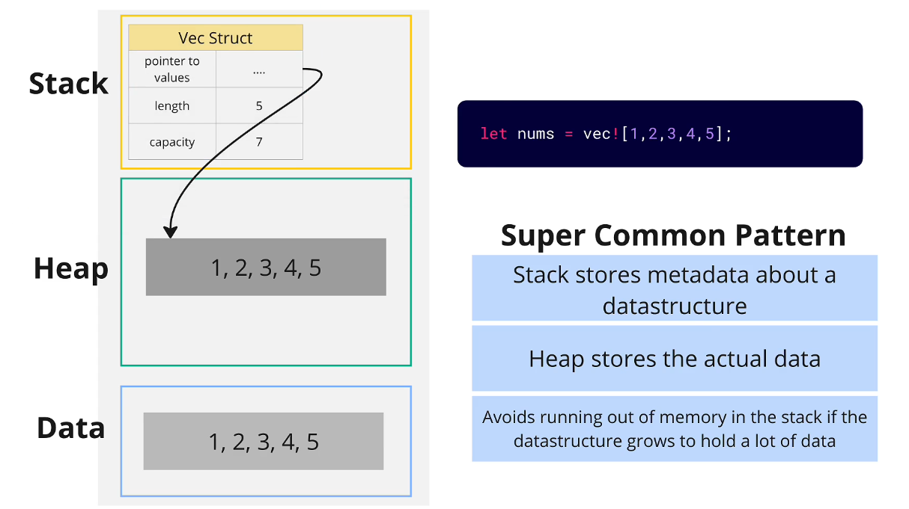

# rust-complete-dev-guide

## Important Links

- Full [video explanation](https://www.udemy.com/course/rust-the-complete-developers-guide/learn/lecture/44784613) with examples of Ownership and Moves

- Rewatch in depth [lecture on &str (string slice)](https://www.udemy.com/course/rust-the-complete-developers-guide/learn/lecture/44784805#overview) Immportant for debuugging

## Projects

1. [deck](#deck)
2. [bank](#bank)
3. [media](#media)

## Definitions

> ⚠️ In Rust "variables" are called "bindings"

> ⚠️ Any time you create a folder inside "src", ypu also have to create a file named "mod.rs"

- Vector: can grow and shrink in size and contains elements
- Array: it is a collection of elements fixed in size
- Trait: a set of functions
  > In other languages _Associated function_ is commonly referred to as _class_
- Associated Function: is a function tied to a struct definition
  - To call an associated function e.g. `impl-name::fun-name`
  - Use when you have a functionality not tied to a specific intance
  - E.g. you want to make a brand new copy of a deck that have different initialization points
- Method: a function that operates on a specific instance of a type "struct" or "enum"
  - The argument must be `&self`
  - Use when you want to read or change fields on a specific instance
- Implicit return: rust is going to return the last executed expression inside the function, as long as it doesn't end eith a semicolomn (;)

> ⚠️ Rust doesn't have "null", "nill", or "undefined"
> Rust forces devs to handle cases in which no value is returned

- Uses instead a _built-in_ enum called "Option"
- Option has 2 variants, "Some" and "None"
  ```
  enum Option {
    Some(value),
    None
  }
  ```
- If you want to work with "Option" you have to use "pattern matching" (if-else or match)

### enums

We can _imagine_ that the following create three structs

```
enum Media {
    Book { title: String, author: String },
    Movie { title: String, director: String },
    Audiobook { title: String }
}
```

> Book, Movie and Audiobook are all of type `Media`

Now we can define functions that accept values of type `Media`, and put it in a `Book` or a `Movie` or an `Audiobook`.

### option enum

```
enum Option {
  Some(value),
  None
}
```

- Option is used when we need to know if a value is present or not
- Some() variant is used when we have a value
- None variant is used when there is no value

#### **Other Ways of handling options**

`item.unwrap()`

- If "item" is a Some, returns the value in Some
- If "item" is a None, panics!

> Use for quick debugging or examples

---

`item.expect("There should be a value here")`

- If "item" is a Some, returns the value in Some
- If "item" is a None, prints the provided debug message and panics!

> Use when we want the program **to crash** if there is no value

---

`item.unwrap_or(&placeholder)`

- If "item" is a Some, returns the value in Some
- If "item" is a None, returns the provided default value

> Use when it makes sense to provide a fallback value

### Result enum

```
enum Result {
  Ok(value),
  Err(error)
}
```

- Result is used when we need to know if something worked or failed
- Ok() variant is used when something went well
- Err() variant is used when something "bad" happened

#### **Example**

```
use::std::io::Error;

fn divide(a: f64, b: f64) -> Result<f64, Error> {
    if b == 0.0 {
        Err(Error::other("can't divide by 0"))
    } else {
        Ok(a/b)
    }
}
```

- We are returning something of type Result
- "< >" indicates is a generic enum, the things we pass inside are like "arguments"


---

## Useful

### Installing external Crates

```
cargo add <crate-name>
```

e.g. to install the [rand package](https://crates.io/crates/rand) which has functionalities to generate random numbers.

```
cargo add rand
```

[See rand docs](https://docs.rs/rand/0.8.5/rand/)

### Formatter

#### {:#}

```
#[derive(Debug)]

// #[derive(Debug)] it is going to be used whenever we try to print `deck` using the Debug Formatter {:?}
    println!("Here is your deck {:#?}", deck);
```

**TERMINAL (cargo run -q):**

```
Here is your deck Deck {
    cards: [
        "Ace of Hearts",
        "Two of Hearts",
        "Three of Hearts",
        "Ace of Spades",
        "Two of Spades",
        "Three of Spades",
        "Ace of Diamonds",
        "Two of Diamonds",
        "Three of Diamonds",
    ],
}
```

### Create a New cargo project with directory name different from package name

Create a New Project with a Directory Named 03_media and a Package Named media Use the following command to specify the directory name and a valid package name:

```
cargo new <directory-name> --name <project-name>
```

- directory-name: The directory name (can start with a digit).
- --name project-name: Sets the package name to project-name (a valid name for the package).

## 10 Rules of Ownership, Borrowing and Lifetimes

1. Every value is owned by a single variable, struct, vector, argument, etc. at a time
2. Reassigning the value to another variable, passing it to a function, putting it into a vector, etc. _moves_ the value. The old variable can't be used anymore!
3. You can create many read-only references to a value that exist at the same time
4. You can't move a value while a ref to the value exists
5. You can make a writeable (mutable) reference to a value only if there are no read-only references currently in use. One mutable ref to a value can exist at a time
6. You can't mutate a value through the owner when any ref (mutable or immutable) to the value exists
7. Some types of values are copied instead of moved (numbers, bools, chars, arrays/tuples with copyable elements)
8. When a variable goes out of scope, the value owned by it is dropped (cleaned up in memory)
9. Values can't be dropped if there are still active references to it
10. References to a value can't outlive the value they refer to

## Ownership

## Borrowing

> References allow us to look at a value without moving it

There are different type of references we can create:

- read-only/immutable ref
- writeable/mutable refs

### Read-only/Immutable references

3. You can create many read-only references to a value that exist at the same time
4. You can't move a value while a ref to the value exists

```
#[derive(Debug)]
struct Account {
    id: u32,
    balance: i32,
    holder: String
}

impl Account {
    fn new(id: u32, holder: String) -> Self {
        Account {
            id,
            holder,
            balance: 0
        }
    }
}

fn main() {
  let account = Account::new(1, String::from("Mattia"));

  let account_ref = &account;

  // If I try to change the value account or account fields it will fail
  // The following will vot compile!!!

  account_ref.id = 2; // This does not compile
}

```

### Writeable/Mutable references

5. You can make a writeable (mutable) reference to a value only if there are no read-only references currently in use. One mutable ref to a value can exist at a time
6. You can't mutate a value through the owner when any ref (mutable or immutable) to the value exists

> Mutable refs allow us to read or change a value without moving it

The following will compile correctly because we are using a mutable variable for account and reassigning the modified value to account, BUT is very manual and tedious.

```
// modify the account balance and returns account
fn change_account(mut account: Account) -> Account {
  account.balance = 10;
  account
}

fn main() {
  // 1. Instantiate a mutable account struct
  let mut account = Account::new(
    1,
    String::from("me")
  );

  // 2. Pass the instance of account to the change_account() function
  // and assign the returned value to account variable
  account = change_account(account);
  println!("{:#?}, account");

}
```

Since _mutable refs_ allow us to read or change a value withouut moving it, a better way to modify the value of account.balance is the following

```
// Takes in as an argument a mutable reference of type Account
fn change_account(account: &mut Account) {
    account.balance = 10;
}

fn main() {

  let mut account = Account::new(1, String::from("me"));

  change_account(&mut account);

  println!("{:#?}", account);
}
```

### Copiable values

7. Some types of values are copied instead of moved (numbers, bools, chars, arrays/tuples with copyable elements)

Copyable values:

- numbers (All)
- bools
- chars
- arrays
- tuples

```
fn main() {
  let num = 5:
  let other_num = num;

  println!("{} {}", num, other_num)
}
```

## Lifetimes

The word "Lifetimes" by itself, refers to how long an owner or reference to a value exists
"Generic Lifetimes"/"Lifetimes Annotations" is Extra syntax added in to clarify reletionships between different lifetimes

8. When a variable goes out of scope, the value owned by it is dropped (cleaned up in memory)
9. Values can't be dropped if there are still active references to it
10. References to a value can't outlive the value they refer to

## Computer memory in Rust

- Stack
- Heap
- Data Segment/Rodata Segment/Static Segment


**Stack**<br>
Stack is fast but of limites size (2-8MB)

**Heap**<br>
Slow but can grow to store a lot of data (Gib)

**Data**<br>
Stores literal value that we write into our code and kinda embedd them in the source code.

### Commmon usage pattern of Stack, Heap, and Data

- Stack stores metadata about a datastructre
- Heap stores the actual data

> This pattern avoids the stack from running out of memory <br>
> if the data structure grows too much



`let nums = vec![1,2,3,4,5];`
Behind the scenes the values are initial stored inn the Data segment
and than copied in the Heap
Finally the Vec Struct pointers, point to the values in the heap.

### Corner case

If a data structure owns another data structure, the child's metadata will be placed on the heap.

```rust
let vec_of_num = vec![
  vec![1,2,3,4,5]
];
```


## Strings from Stack, Heap, Data perpective

- `String`
- `&String`
- `&str`

### String

```rust
let color = String::from("red");
```

1. "red" is stored in _Data_
2. "red" is copied into _Heap_
3. The String Struct is stored in the _Stack_
   - pointer to text --> _Heap_
   - lenght of String "red"
   - capacity of String "red"


### &String

```rust
let color = String::from("red");
let color_ref = &color;
```

1. "red" is stored in _Data_
2. "red" is copied into _Heap_
3. The String Struct is stored in the _Stack_
   - pointer to text --> _Heap_
   - lenght of String "red"
   - capacity of String "red"
4. A Ref to "red" is stored in _Stack_ --> String "red" also in _Stack_


### &str (String slice) - method 1

```rust
let name: &str = "me"
```

1. "me" is stored in _Data_
2. &str struct is stored in \_Stack. It has only 2 fiels:
   - pointer to text
   - length of string
3. Pointer, points directly to _Data_


### &str (String slice) - method 2

```rust
let color = String::from("red");
let c = color.as_str();
```

1. "red" is stored in _Data_
2. "red" is copied into _Heap_
3. The String Struct is stored in the _Stack_
   - pointer to text --> _Heap_
   - lenght of String "red"
   - capacity of String "red"
4. &str struct is stored in \_Stack. It has only 2 fiels:
   - pointer to text
   - length of string
5. Pointer, points to _Heap_


### Why is there &String, and &str?

> `&String` and `&str` are both a read-only reference to text-data.

Reason 1: sometimes we might prefer to point directly at _Data_ for memory optimization. (See [method1](#str-string-slice---method-1))

Reason 2: &str lets you take a portion of a text (_slice_) that is already on the _Heap_

```rust
let color = String::from("blue");
let portion = &color[1..4];
```


### Split method in Rust

```
fn extract_errors(text: &str) -> Vec<&str> {
 let split_text = text.split("\n");
 let mut results = vec![];

 for line in split_text {
     if line.starts_with("ERROR") {
         results.push(line);
     }
 }

    results
}
```

- `Split` returns a `Vec<&str>`
  - `let split_text: Vec<&str> = text.split("\n")`;

> In the following image we ignore stack/heap for simplicity
> 

- text: String
- word_list: Vec<&str>
- Each `&str`in the `word_list` points at the first character of each word

## `?` operator (also called 'Try' operator)

> '?' operator gets added onto functions that return a 'Result'

```rust
fn main() -> Result<(), Error> {
  let text = fs::read_to_string("logs.txt")?;
}
```

- If the `fn main()` returns `Ok(..)`: <br>
  -> '?' is going to automatically unwrap the text and assign it to the variable

- If the `fn main()` returns `Err`: <br>
  -> As soon as the Error happens the operator '?' is going to unwrap and return the error. NOT assigning it to the variable.

## match || if v.s. unwrap() || expect() v.s. '?' (try operator)

1. Use `match` or `if let` statement when you want to deal meaningfully with an error
2. Use `unwrap()` or `expect` on the `Result` for quick debugging or if you want the app to crash on an `Err`
3. Use `?` to unwrap or propagate the `Result`

### Use `match` or `if let`

- **Task:** Read some config data from a file
- If fails to read the file, use some backup default config (NOT juust logging the error)

> This falls into the deal meaningfully with an error

**Code example**

- In this example we are handling the error by using a default configuration in case the
  `read_config_file` fails

```rust
fn read_config_file() -> Result<String, Error> {
  fs::read_to_string("config.json")
}

fn get_config() -> String {
  let default_config = String::from("{enable_debug: true}")
}

  match read_config_file() {
    Ok(config) => config,
    Err(_err) => {
      println!("Config read error, using default_config")
      default_config
    }
  }
```

### Use `?` try operator

- **Task:** Read some config data from a file
- If fails to read the file, exit

> In this case we are not dealing meaningfully with the error, we just want to unwrap or propagate the `Result`
> We are relying on the parent function to deal with the error

**Code example**

- In this example we are ha

```rust
fn read_config_file() -> Result<String, Error> {
  fs::read_to_string("config.json")
}

fn get_config() -> String {
  let config = read_config_file()?;

  Ok(config)
}

fn main() -> Result<(), Error> {
  let config = get_config()?;
  println!("Got a config: {}", config);

  Ok(())
}
```

## bank

We want to create a project that simulates a bank

Each account will have 3 fields:

- id (unsigned integer)
- balance (integer)
- holder (String)

We will have a struct type representing a bank and another struct type representing an account.

The bank will have tied n number of accounts.

## Implementation

> With every function we write, we need to think about whether we are receiving values or refs
> With every data structure we define, we need to think about whether we are storing values or refs

### Bank Methods

<!-- prettier-ignore-start -->

| Description                                            | Method or Assoc. Func? | Name     | Args                  | Returns |
|--------------------------------------------------------|-----------------------|----------|----------------------|---------|
| Create a 'Bank' instance                                | Assoc. Func           | new()    | -                    | Bank    |
| Add an account to the list of accounts                  | Method                | add_account() | account: Account    |         |
| Calculate the total balance of all accounts             | Method                | total_balance() | -                  | i32     |
| Create a `Vec` containing the summaries of all accounts | Method                | summary() | -                   | Vec<String> |

### Account Methods

| Description                                            | Method or Assoc. Func? | Name      | Args                      | Returns  |
|--------------------------------------------------------|-----------------------|-----------|--------------------------|----------|
| Create an 'Account' instance                            | Assoc. Func           | new()     | id: u32, holder: String   | Account  |
| Add the given amount of money to the account's 'balance'| Method                | deposit()  | amount: i32              |      i32    |
| Remove the given amount of money from the account's 'balance'. | Method           | withdraw() | amount: i32              |     i32     |
| Create an account summary as a string and return it     | Method                | summary()  | -                        | String   |

<!-- prettier-ignore-end -->

## media

This application is going to modeal a **media storage app**

<!-- prettier-ignore-start -->

| Book    |         |
|---------|---------|
| title   | String  |
| author  | String  |

| Movie   |         |
|---------|---------|
| title   | String  |
| director| String  |

| Audiobook|      |
|---------|---------|
| title   | String  |

<!-- prettier-ignore-end -->

We are going to create a `catolog`.
We should than be able to store books, movies and audiobooks inside the catalog.
We also want to have a search operation based on "author", "media type", etc...

### Implementation

We have 2 options to model `Book`, `Movie` and `Audiobook`:

- Structs
- Enums

```
enum Media {
    Book { title: String, author: String },
    Movie { title: String, director: String },
    Audiobook { title: String }
}
```

> When should we use enums vs structs?

Ask the following question to decide:

- _Does each thing I am modeling have the same methods?_
  -> It is probably better to use "enums"

- _Does each thing have some same, but some different methods?_
  -> It is probably better to use "structs"

### Custom Implementation of "option"

The following enum is a specific implementation of "option", just to show
how it works

```
fn get_by_index(&self, index:usize) -> MightHaveValue {
    if self.items.len() > index {
        MightHaveValue::ThereIsValue(&self.items[index])
    } else {
        // In Rust we have to return something!
        MightHaveValue::NoValue
    }
}


enum MightHaveValue<'a> {
    ThereIsValue(&'a Media),
    NoValue,
}
```

## Media project refactoring with Multiple Modules

We are going to keep in the `root module` only the `fn main()`

We'll create a submodule `content module` that contain our:

- `enum Media{}`
- `struct Catalog{}`

### Different ways of creating modules

- **Option 1**: create a module in an existing file
- **Option 2**: create a module in an new single file in the same folder of main module

#### **Option 1**: create a module in an existing file

> Most appropriate when you have a really large file with a lot of stuff, but you want to keep everything in the same file

_example_

```
mod content {
  pub enum Media { /* fields */ }
  /* Media impl */
  pub struct Catalog { /* fields */ }
  /* Catalog impl */
}

fn main() {
  let catalog = content::Catalog::new()
}
```

By default everything inside a module is "private"
To make it accessible outside the module you have to make it "public", `pub`

#### **Option 2**: create a module in an new single file in the same folder

> Most appropriate when you want a separate module to organize code, but it doesn't need to span several files

_example_

`src/content.rs`

```
pub enum Media { /* fields */ }
/* Media impl */
pub struct Catalog { /* fields */ }
/* Catalog impl */
```

`main.rs`

```
mod content; // name of the file that contains our module

use content::Catalog;

fn main() {
  let catalog = Catalog::new()
}
```

#### **Option 3**: spread code out among separate files in a new folder

> Most appropriate when you have a large module
> Every file and folder makes its own separate module

_example_

`content/media.rs`

```
pub enum Media { /* fields */ }
/* Media impl */
```

`content/catalog.rs`

```
pub struct Catalog { /* fields */ }
/* Catalog impl */
```

`content/mod.rs`

> in this case is required to create a mod.rs file

```
pub mod media;
pub mod catalog;
```

`main.rs`

```
mod content;

use content::Catalog;

fn main() {
  let catalog = Catalog::new()
}
```

## 04 logs progect

We are going to create a logs.txt full of mocked logs from, for example, our web server.

Then we will:

1. Open and parse the logs.txt file
2. Extracts some useful data from the file
3. Make sure we have robust error handling
